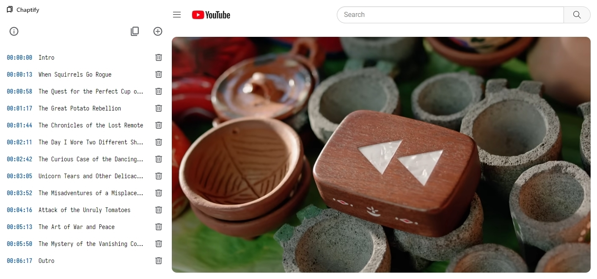

# Chaptify

Enhance your YouTube™ experience with our Google Chrome™ extension. Instantly mark key moments and create chapters for any video, streamlining content organization and improving viewer navigation.

## Easy Access

Chaptify conveniently operates from the browser’s side panel. Activate it with a simple click on the extension’s icon or by pressing `Ctrl + B`. You are free to remap key combination at `chrome://extensions/shortcuts`.

## Effortless Chapter Creation

Add a chapter by clicking the plus button located in the video’s control panel or within Chaptify’s side panel. Each chapter captures the current video timestamp for precise navigation.

## Customization at Your Fingertips

Modify chapter titles to reflect content accurately or remove them as needed. Utilize the side panel’s copy feature to transfer all chapters directly to your clipboard. When added to the video’s description or a pinned comment, these chapters enhance the video’s accessibility.

## Trademark Acknowledgment

Google Chrome and YouTube are trademarks of Google LLC. Use of these trademarks is subject to Google Permissions.

## Privacy Policy

Chaptify respects your privacy and does not process user data.
